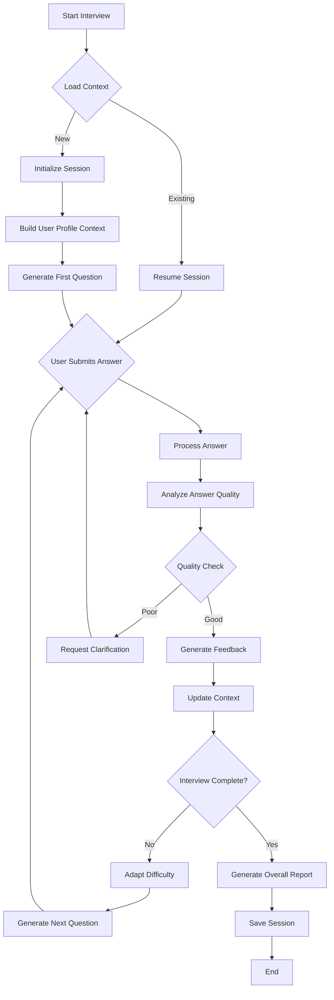

# AI SYSTEM ARCHITECTURE - MockMate Interview Simulator

## 📋 MỤC LỤC

1. [Tổng Quan Hệ Thống AI](#tổng-quan-hệ-thống-ai)
2. [Kiến Trúc Tầng AI (AI Layer Architecture)](#kiến-trúc-tầng-ai)
3. [AI Orchestration Engine](#ai-orchestration-engine)
4. [Prompt Engineering System](#prompt-engineering-system)
5. [Context Management](#context-management)
6. [Response Processing Pipeline](#response-processing-pipeline)
7. [Caching & Optimization](#caching--optimization)
8. [Monitoring & Analytics](#monitoring--analytics)
9. [Implementation Code Examples](#implementation-code-examples)

---

## 1. TỔNG QUAN HỆ THỐNG AI

### 1.1 Vấn Đề Với Cách Tiếp Cận Đơn Giản

**❌ Approach Đơn Giản (Không Nên):**
```csharp
// Bad: Direct API call without system
public async Task<string> GetAnswer(string question)
{
    var response = await httpClient.PostAsync(
        "https://api.gemini.com/...",
        new { prompt = question }
    );
    return await response.Content.ReadAsStringAsync();
}
```

**Vấn đề:**
- ❌ Không có context management
- ❌ Không validate/sanitize input
- ❌ Không handle errors properly
- ❌ Không optimize cost (mỗi lần đều call API)
- ❌ Không track performance
- ❌ Không consistent response format
- ❌ Không adaptive/learning

### 1.2 Hệ Thống AI Hoàn Chỉnh

**✅ Production-Ready AI System:**

```
┌─────────────────────────────────────────────────────────┐
│                   APPLICATION LAYER                     │
│              (Controllers, UI Components)               │
└────────────────────┬────────────────────────────────────┘
                     │
                     ↓
┌─────────────────────────────────────────────────────────┐
│              AI ORCHESTRATION ENGINE                    │
│  ┌──────────────┐  ┌──────────────┐  ┌──────────────┐ │
│  │   Session    │  │   Request    │  │   Response   │ │
│  │  Management  │→ │  Validator   │→ │   Parser     │ │
│  └──────────────┘  └──────────────┘  └──────────────┘ │
└────────────────────┬────────────────────────────────────┘
                     │
                     ↓
┌─────────────────────────────────────────────────────────┐
│                 AI SERVICE LAYER                        │
│  ┌──────────────────────────────────────────────────┐  │
│  │           PROMPT ENGINEERING SYSTEM              │  │
│  │  • Template Manager                              │  │
│  │  • Context Builder                               │  │
│  │  • Dynamic Prompt Generator                      │  │
│  └──────────────────────────────────────────────────┘  │
│                                                         │
│  ┌──────────────┐  ┌──────────────┐  ┌──────────────┐ │
│  │   Context    │  │    Cache     │  │  Fallback    │ │
│  │   Manager    │  │   Manager    │  │   Handler    │ │
│  └──────────────┘  └──────────────┘  └──────────────┘ │
└────────────────────┬────────────────────────────────────┘
                     │
                     ↓
┌─────────────────────────────────────────────────────────┐
│           AI PROVIDER ABSTRACTION LAYER                 │
│  ┌──────────────┐  ┌──────────────┐  ┌──────────────┐ │
│  │   Gemini     │  │   OpenAI     │  │   Claude     │ │
│  │   Adapter    │  │   Adapter    │  │   Adapter    │ │
│  └──────────────┘  └──────────────┘  └──────────────┘ │
└────────────────────┬────────────────────────────────────┘
                     │
                     ↓
┌─────────────────────────────────────────────────────────┐
│        EXTERNAL AI APIS & INFRASTRUCTURE                │
│  • Google Gemini  • OpenAI  • Speech-to-Text           │
│  • Database  • Cache (Redis)  • Monitoring              │
└─────────────────────────────────────────────────────────┘
```

---

## 2. KIẾN TRÚC TẦNG AI (AI LAYER ARCHITECTURE)

### 2.1 Folder Structure Chi Tiết

```
📁 InterviewSimulator/
├── 📁 AI/                           [CORE AI SYSTEM]
│   ├── 📁 Orchestration/            
│   │   ├── IInterviewOrchestrator.cs
│   │   ├── InterviewOrchestrator.cs  → Main engine
│   │   └── SessionState.cs           → Track conversation
│   │
│   ├── 📁 Services/
│   │   ├── Interfaces/
│   │   │   ├── IAiProvider.cs        → Abstract AI provider
│   │   │   ├── IPromptService.cs
│   │   │   ├── IContextService.cs
│   │   │   └── IResponseProcessor.cs
│   │   │
│   │   └── Implementations/
│   │       ├── GeminiProvider.cs     → Gemini implementation
│   │       ├── OpenAiProvider.cs     → OpenAI implementation
│   │       ├── PromptService.cs
│   │       ├── ContextService.cs
│   │       └── ResponseProcessor.cs
│   │
│   ├── 📁 PromptEngineering/
│   │   ├── PromptTemplates/
│   │   │   ├── InterviewTemplates.cs
│   │   │   ├── CvAnalysisTemplates.cs
│   │   │   └── FeedbackTemplates.cs
│   │   ├── PromptBuilder.cs          → Dynamic prompt construction
│   │   └── PromptValidator.cs        → Prevent injection
│   │
│   ├── 📁 Context/
│   │   ├── Models/
│   │   │   ├── InterviewContext.cs
│   │   │   ├── UserContext.cs
│   │   │   └── ConversationHistory.cs
│   │   ├── ContextManager.cs         → Manage conversation state
│   │   └── ContextSerializer.cs      → Save/load context
│   │
│   ├── 📁 ResponseProcessing/
│   │   ├── ResponseValidator.cs      → Validate AI output
│   │   ├── ResponseParser.cs         → Parse JSON/text
│   │   ├── ResponseSanitizer.cs      → Clean unsafe content
│   │   └── ResponseFormatter.cs      → Format for display
│   │
│   ├── 📁 Cache/
│   │   ├── ICacheStrategy.cs
│   │   ├── RedisCacheStrategy.cs
│   │   ├── InMemoryCacheStrategy.cs
│   │   └── CacheKeyGenerator.cs
│   │
│   ├── 📁 Monitoring/
│   │   ├── AiMetrics.cs              → Track AI performance
│   │   ├── AiLogger.cs               → Log AI interactions
│   │   └── CostTracker.cs            → Monitor API costs
│   │
│   └── 📁 Configuration/
│       ├── AiSettings.cs             → AI config model
│       └── ProviderConfig.cs         → Provider-specific settings
│
├── 📁 Controllers/
│   └── InterviewController.cs        → Uses AI Orchestrator
│
└── 📁 Services/
    └── InterviewService.cs           → Business logic + AI
```

---

## 3. AI ORCHESTRATION ENGINE

### 3.1 InterviewOrchestrator - Quản Lý Toàn Bộ Flow

**Vai trò:**
- Điều phối tất cả AI operations
- Quản lý session state
- Adaptive question generation
- Response quality control

**Flow Diagram:**



### 3.2 Implementation Code

```csharp
// File: AI/Orchestration/IInterviewOrchestrator.cs
namespace InterviewSimulator.AI.Orchestration
{
    public interface IInterviewOrchestrator
    {
        Task<InterviewSession> StartSessionAsync(
            int userId, 
            int jobPositionId, 
            InterviewSettings settings
        );
        
        Task<QuestionResponse> ProcessAnswerAsync(
            int sessionId,
            string answer,
            InterviewMetadata metadata
        );
        
        Task<InterviewReport> CompleteSessionAsync(int sessionId);
        
        Task<SessionState> GetSessionStateAsync(int sessionId);
    }
}

// File: AI/Orchestration/InterviewOrchestrator.cs
public class InterviewOrchestrator : IInterviewOrchestrator
{
    private readonly IContextService _contextService;
    private readonly IPromptService _promptService;
    private readonly IAiProvider _aiProvider;
    private readonly IResponseProcessor _responseProcessor;
    private readonly ICacheStrategy _cache;
    private readonly AiMetrics _metrics;
    private readonly AiLogger _logger;

    public InterviewOrchestrator(
        IContextService contextService,
        IPromptService promptService,
        IAiProvider aiProvider,
        IResponseProcessor responseProcessor,
        ICacheStrategy cache,
        AiMetrics metrics,
        AiLogger logger
    )
    {
        _contextService = contextService;
        _promptService = promptService;
        _aiProvider = aiProvider;
        _responseProcessor = responseProcessor;
        _cache = cache;
        _metrics = metrics;
        _logger = logger;
    }

    public async Task<InterviewSession> StartSessionAsync(
        int userId, 
        int jobPositionId, 
        InterviewSettings settings)
    {
        var startTime = DateTime.UtcNow;
        
        try
        {
            // 1. Build comprehensive context
            var context = await _contextService.BuildInterviewContextAsync(
                userId, 
                jobPositionId, 
                settings
            );
            
            // 2. Generate first question with context
            var firstQuestion = await GenerateAdaptiveQuestionAsync(
                context, 
                questionIndex: 1
            );
            
            // 3. Initialize session state
            var sessionState = new SessionState
            {
                UserId = userId,
                JobPositionId = jobPositionId,
                Settings = settings,
                Context = context,
                CurrentQuestionIndex = 1,
                TotalQuestions = settings.GetQuestionCount(),
                StartTime = startTime,
                ConversationHistory = new List<ConversationTurn>()
            };
            
            // 4. Cache session state
            await _cache.SetAsync(
                $"session:{sessionState.SessionId}", 
                sessionState, 
                TimeSpan.FromHours(2)
            );
            
            // 5. Log metrics
            _logger.LogSessionStart(sessionState);
            
            return new InterviewSession
            {
                SessionId = sessionState.SessionId,
                FirstQuestion = firstQuestion,
                Context = context.GetSummary()
            };
        }
        catch (Exception ex)
        {
            _logger.LogError("StartSession failed", ex);
            throw;
        }
    }

    public async Task<QuestionResponse> ProcessAnswerAsync(
        int sessionId,
        string answer,
        InterviewMetadata metadata)
    {
        var processingStart = DateTime.UtcNow;
        
        // 1. Load session state
        var sessionState = await LoadSessionStateAsync(sessionId);
        
        // 2. Validate and sanitize input
        var sanitizedAnswer = _responseProcessor.SanitizeInput(answer);
        
        // 3. Update conversation history
        sessionState.ConversationHistory.Add(new ConversationTurn
        {
            QuestionIndex = sessionState.CurrentQuestionIndex,
            Question = sessionState.CurrentQuestion,
            Answer = sanitizedAnswer,
            Timestamp = processingStart,
            Metadata = metadata
        });
        
        // 4. Evaluate answer with full context
        var evaluation = await EvaluateAnswerAsync(
            sessionState.CurrentQuestion,
            sanitizedAnswer,
            sessionState.Context,
            sessionState.ConversationHistory
        );
        
        // 5. Update session metrics
        sessionState.Scores.Add(evaluation.Score);
        sessionState.UpdateDifficultyLevel(evaluation);
        
        // 6. Generate next question (adaptive)
        QuestionData nextQuestion = null;
        if (!sessionState.IsComplete)
        {
            sessionState.CurrentQuestionIndex++;
            nextQuestion = await GenerateAdaptiveQuestionAsync(
                sessionState.Context,
                sessionState.CurrentQuestionIndex,
                sessionState.ConversationHistory,
                sessionState.CurrentDifficulty
            );
            sessionState.CurrentQuestion = nextQuestion.Content;
        }
        
        // 7. Save updated state
        await _cache.SetAsync(
            $"session:{sessionId}", 
            sessionState, 
            TimeSpan.FromHours(2)
        );
        
        // 8. Track metrics
        _metrics.TrackAnswerProcessing(
            sessionId, 
            (DateTime.UtcNow - processingStart).TotalMilliseconds
        );
        
        return new QuestionResponse
        {
            Evaluation = evaluation,
            NextQuestion = nextQuestion,
            Progress = sessionState.GetProgress(),
            IsComplete = sessionState.IsComplete
        };
    }

    private async Task<QuestionData> GenerateAdaptiveQuestionAsync(
        InterviewContext context,
        int questionIndex,
        List<ConversationTurn> history = null,
        DifficultyLevel currentDifficulty = DifficultyLevel.Medium)
    {
        // Build dynamic prompt with context
        var prompt = _promptService.BuildQuestionPrompt(new QuestionPromptParams
        {
            Context = context,
            QuestionIndex = questionIndex,
            TotalQuestions = context.Settings.GetQuestionCount(),
            ConversationHistory = history,
            CurrentDifficulty = currentDifficulty,
            JobRequirements = context.JobRequirements,
            UserProfile = context.UserProfile
        });
        
        // Call AI provider
        var aiResponse = await _aiProvider.GenerateAsync(prompt);
        
        // Process and validate response
        var question = _responseProcessor.ParseQuestion(aiResponse);
        
        // Validate question quality
        if (!IsValidQuestion(question, context))
        {
            // Retry with adjusted prompt
            return await GenerateAdaptiveQuestionAsync(
                context, 
                questionIndex, 
                history, 
                currentDifficulty
            );
        }
        
        return question;
    }

    private async Task<AnswerEvaluation> EvaluateAnswerAsync(
        string question,
        string answer,
        InterviewContext context,
        List<ConversationTurn> history)
    {
        // Build evaluation prompt with full context
        var prompt = _promptService.BuildEvaluationPrompt(new EvaluationPromptParams
        {
            Question = question,
            Answer = answer,
            Context = context,
            History = history
        });
        
        // Call AI
        var aiResponse = await _aiProvider.GenerateAsync(prompt);
        
        // Parse structured evaluation
        var evaluation = _responseProcessor.ParseEvaluation(aiResponse);
        
        // Validate evaluation
        if (!evaluation.IsValid())
        {
            throw new InvalidEvaluationException("AI returned invalid evaluation");
        }
        
        return evaluation;
    }

    private async Task<SessionState> LoadSessionStateAsync(int sessionId)
    {
        var cacheKey = $"session:{sessionId}";
        var state = await _cache.GetAsync<SessionState>(cacheKey);
        
        if (state == null)
        {
            // Fallback: load from database
            state = await LoadFromDatabaseAsync(sessionId);
        }
        
        return state;
    }
}
```

---

## 4. PROMPT ENGINEERING SYSTEM

### 4.1 Prompt Template Management

**Tại sao cần system này:**
- ✅ Tái sử dụng prompts
- ✅ A/B testing prompts
- ✅ Version control
- ✅ Dynamic variable injection
- ✅ Multi-language support

```csharp
// File: AI/PromptEngineering/PromptTemplates/InterviewTemplates.cs
public class InterviewTemplates
{
    // Template với versioning
    public static PromptTemplate QuestionGeneration_V2 = new PromptTemplate
    {
        Id = "interview.question.v2",
        Version = "2.0",
        Language = "en",
        SystemPrompt = @"
You are an expert technical interviewer with 15+ years of experience.
Your goal is to assess the candidate's skills through thoughtful, realistic questions.

CORE PRINCIPLES:
1. Ask questions that real companies ask in interviews
2. Adapt difficulty based on previous answers
3. Mix theoretical knowledge with practical scenarios
4. Be professional but conversational
5. Provide constructive feedback
",
        UserPromptTemplate = @"
=== INTERVIEW CONTEXT ===
Job Position: {{JobTitle}}
Seniority Level: {{SeniorityLevel}}
Required Skills: {{RequiredSkills}}

=== CANDIDATE PROFILE ===
Experience: {{ExperienceYears}} years
Background: {{CvSummary}}
Previous Performance: {{PerformanceSummary}}

=== INTERVIEW PROGRESS ===
Current Question: {{QuestionIndex}} / {{TotalQuestions}}
Difficulty Level: {{CurrentDifficulty}}
Topics Covered: {{CoveredTopics}}

{{#if ConversationHistory}}
=== PREVIOUS Q&A ===
{{#each ConversationHistory}}
Q{{@index}}: {{Question}}
A{{@index}}: {{AnswerSummary}} (Score: {{Score}}/10)
{{/each}}
{{/if}}

=== TASK ===
Generate the next interview question following these rules:

1. QUESTION TYPE: Choose from:
   - Technical Knowledge (if {{QuestionIndex}} <= 3)
   - Problem Solving / System Design (if {{QuestionIndex}} 4-7)
   - Behavioral / Experience (if {{QuestionIndex}} >= 8)

2. DIFFICULTY ADAPTATION:
   - If last answer score >= 8: Increase difficulty
   - If last answer score < 5: Decrease difficulty
   - Otherwise: Maintain current level

3. QUESTION CHARACTERISTICS:
   - Must be specific to {{JobTitle}}
   - Should relate to {{RequiredSkills}}
   - Avoid repeating topics from {{CoveredTopics}}
   - Should take 2-4 minutes to answer

4. OUTPUT FORMAT:
Return ONLY a valid JSON object:
{
  ""question"": ""Your question here"",
  ""expectedKeyPoints"": [""point1"", ""point2"", ""point3""],
  ""difficulty"": ""beginner|intermediate|advanced"",
  ""category"": ""technical|problem-solving|behavioral"",
  ""timeLimit"": 180
}

Generate the question now:
"
    };

    public static PromptTemplate AnswerEvaluation_V2 = new PromptTemplate
    {
        Id = "interview.evaluation.v2",
        Version = "2.0",
        SystemPrompt = @"
You are an expert interviewer evaluating candidate answers.
You must be fair, objective, and provide actionable feedback.

EVALUATION CRITERIA:
1. Relevance (0-3 pts): Does the answer address the question?
2. Technical Accuracy (0-3 pts): Is the information correct?
3. Depth (0-2 pts): Does it show deep understanding?
4. Communication (0-2 pts): Is it clear and well-structured?

TOTAL SCORE: Sum of above (0-10)
",
        UserPromptTemplate = @"
=== QUESTION ===
{{Question}}

Expected Key Points: {{ExpectedKeyPoints}}

=== CANDIDATE ANSWER ===
{{Answer}}

Time Taken: {{TimeTaken}} seconds (Limit: {{TimeLimit}} seconds)

=== JOB CONTEXT ===
Position: {{JobTitle}}
Required Skills: {{RequiredSkills}}
Seniority: {{SeniorityLevel}}

=== EVALUATION TASK ===
Evaluate this answer and return a JSON object:

{
  ""score"": 7.5,
  ""breakdown"": {
    ""relevance"": 2.5,
    ""technicalAccuracy"": 2.0,
    ""depth"": 1.5,
    ""communication"": 1.5
  },
  ""strengths"": [
    ""Mentioned key concept X"",
    ""Provided practical example""
  ],
  ""weaknesses"": [
    ""Missed important aspect Y"",
    ""Could elaborate on Z""
  ],
  ""feedback"": ""Your answer demonstrates solid understanding of the basics. To improve, consider discussing [specific suggestion]."",
  ""suggestedTopicsToStudy"": [""Topic A"", ""Topic B""],
  ""nextQuestionDifficulty"": ""intermediate""
}

Evaluate now:
"
    };
}
```

### 4.2 Prompt Builder - Dynamic Construction

```csharp
// File: AI/PromptEngineering/PromptBuilder.cs
public class PromptBuilder
{
    private readonly IHandlebarsEngine _handlebars;
    private readonly PromptValidator _validator;

    public string BuildPrompt(PromptTemplate template, object data)
    {
        // 1. Validate input data
        _validator.ValidateInputData(data);
        
        // 2. Compile template với Handlebars
        var compiledSystem = _handlebars.Compile(template.SystemPrompt);
        var compiledUser = _handlebars.Compile(template.UserPromptTemplate);
        
        // 3. Inject data
        var systemPrompt = compiledSystem(data);
        var userPrompt = compiledUser(data);
        
        // 4. Sanitize để prevent injection
        systemPrompt = _validator.SanitizePrompt(systemPrompt);
        userPrompt = _validator.SanitizePrompt(userPrompt);
        
        // 5. Combine
        return new BuiltPrompt
        {
            SystemPrompt = systemPrompt,
            UserPrompt = userPrompt,
            Metadata = new PromptMetadata
            {
                TemplateId = template.Id,
                Version = template.Version,
                CreatedAt = DateTime.UtcNow
            }
        };
    }
}
```

---

## 5. CONTEXT MANAGEMENT

### 5.1 Context Architecture

**Context management** là trái tim của hệ thống AI thông minh.

```csharp
// File: AI/Context/Models/InterviewContext.cs
public class InterviewContext
{
    // User Information
    public UserProfile UserProfile { get; set; }
    
    // Job Information
    public JobPosition JobPosition { get; set; }
    public List<string> RequiredSkills { get; set; }
    public SeniorityLevel SeniorityLevel { get; set; }
    
    // Interview Settings
    public InterviewSettings Settings { get; set; }
    public DifficultyLevel CurrentDifficulty { get; set; }
    
    // Conversation State
    public ConversationHistory History { get; set; }
    public List<string> CoveredTopics { get; set; }
    public Dictionary<string, double> SkillScores { get; set; }
    
    // Adaptive Parameters
    public AdaptiveState Adaptive { get; set; }
    
    // Metadata
    public DateTime CreatedAt { get; set; }
    public DateTime LastUpdated { get; set; }
}

public class UserProfile
{
    public int UserId { get; set; }
    public string FullName { get; set; }
    public int ExperienceYears { get; set; }
    
    // CV Analysis Results
    public string CvSummary { get; set; }
    public List<string> IdentifiedSkills { get; set; }
    public List<string> StrengthAreas { get; set; }
    public List<string> WeakAreas { get; set; }
    
    // Historical Performance
    public double AverageScore { get; set; }
    public List<CompletedInterview> PreviousInterviews { get; set; }
}

public class AdaptiveState
{
    public int ConsecutiveHighScores { get; set; }
    public int ConsecutiveLowScores { get; set; }
    public List<string> StrugglingSections { get; set; }
    public List<string> ExcellingTopics { get; set; }
    
    // Learning curve tracking
    public double ImprovementRate { get; set; }
    public DifficultyTrend Trend { get; set; }
}
```

### 5.2 Context Service Implementation

```csharp
// File: AI/Context/ContextManager.cs
public class ContextManager : IContextService
{
    private readonly MockMateDbContext _db;
    private readonly ICacheStrategy _cache;
    
    public async Task<InterviewContext> BuildInterviewContextAsync(
        int userId, 
        int jobPositionId, 
        InterviewSettings settings)
    {
        // 1. Load user profile with CV analysis
        var userProfile = await BuildUserProfileAsync(userId);
        
        // 2. Load job requirements
        var jobPosition = await _db.JobPositions
            .Include(j => j.Category)
            .FirstOrDefaultAsync(j => j.Id == jobPositionId);
        
        // 3. Analyze required skills
        var requiredSkills = ParseRequiredSkills(jobPosition.Requirements);
        
        // 4. Load user's interview history
        var previousInterviews = await _db.InterviewSessions
            .Where(s => s.UserId == userId && s.Status == SessionStatus.Completed)
            .OrderByDescending(s => s.EndedAt)
            .Take(5)
            .ToListAsync();
        
        // 5. Calculate adaptive parameters
        var adaptiveState = CalculateAdaptiveState(
            userProfile, 
            previousInterviews, 
            settings
        );
        
        // 6. Build comprehensive context
        var context = new InterviewContext
        {
            UserProfile = userProfile,
            JobPosition = jobPosition,
            RequiredSkills = requiredSkills,
            SeniorityLevel = DetermineSeniorityLevel(
                userProfile.ExperienceYears, 
                settings.DifficultyLevel
            ),
            Settings = settings,
            CurrentDifficulty = settings.DifficultyLevel,
            History = new ConversationHistory(),
            CoveredTopics = new List<string>(),
            SkillScores = new Dictionary<string, double>(),
            Adaptive = adaptiveState,
            CreatedAt = DateTime.UtcNow,
            LastUpdated = DateTime.UtcNow
        };
        
        return context;
    }
    
    private async Task<UserProfile> BuildUserProfileAsync(int userId)
    {
        var user = await _db.Users.FindAsync(userId);
        
        // Get CV analysis if available
        var cvAnalysis = await _db.CvAnalysisResults
            .Where(c => c.UserId == userId)
            .OrderByDescending(c => c.CreatedAt)
            .FirstOrDefaultAsync();
        
        // Get previous performance
        var avgScore = await _db.InterviewSessions
            .Where(s => s.UserId == userId && s.TotalScore.HasValue)
            .Select(s => s.TotalScore.Value)
            .DefaultIfEmpty(0)
            .AverageAsync();
        
        return new UserProfile
        {
            UserId = user.Id,
            FullName = user.FullName,
            ExperienceYears = user.ExperienceYears ?? 0,
            CvSummary = cvAnalysis?.AnalysisJson != null 
                ? ExtractCvSummary(cvAnalysis.AnalysisJson) 
                : "No CV analysis available",
            IdentifiedSkills = cvAnalysis != null 
                ? ExtractSkills(cvAnalysis.AnalysisJson) 
                : new List<string>(),
            AverageScore = avgScore
        };
    }
    
    private AdaptiveState CalculateAdaptiveState(
        UserProfile profile, 
        List<InterviewSession> history,
        InterviewSettings settings)
    {
        var state = new AdaptiveState
        {
            ConsecutiveHighScores = 0,
            ConsecutiveLowScores = 0,
            StrugglingSections = new List<string>(),
            ExcellingTopics = new List<string>()
        };
        
        if (!history.Any()) return state;
        
        // Analyze recent performance trends
        var recentScores = history
            .SelectMany(h => h.SessionDetails)
            .OrderByDescending(d => d.CreatedAt)
            .Take(10)
            .Select(d => d.Score ?? 0)
            .ToList();
        
        // Count consecutive high/low scores
        foreach (var score in recentScores)
        {
            if (score >= 8)
                state.ConsecutiveHighScores++;
            else if (score < 5)
                state.ConsecutiveLowScores++;
            else
                break; // Reset on normal score
        }
        
        // Calculate improvement rate
        if (history.Count >= 2)
        {
            var firstSession = history.Last().TotalScore ?? 0;
            var lastSession = history.First().TotalScore ?? 0;
            state.ImprovementRate = (lastSession - firstSession) / history.Count;
        }
        
        return state;
    }
    
    public async Task UpdateContextAsync(
        string sessionId, 
        ConversationTurn turn)
    {
        var context = await _cache.GetAsync<InterviewContext>($"context:{sessionId}");
        
        // Update conversation history
        context.History.Turns.Add(turn);
        
        // Update covered topics
        var topics = ExtractTopics(turn.Question);
        context.CoveredTopics.AddRange(topics.Where(t => !context.CoveredTopics.Contains(t)));
        
        // Update skill scores
        foreach (var skill in turn.EvaluatedSkills)
        {
            if (!context.SkillScores.ContainsKey(skill.Name))
                context.SkillScores[skill.Name] = skill.Score;
            else
                context.SkillScores[skill.Name] = 
                    (context.SkillScores[skill.Name] + skill.Score) / 2;
        }
        
        // Update adaptive state
        UpdateAdaptiveState(context.Adaptive, turn.Evaluation);
        
        // Update difficulty if needed
        if (context.Adaptive.ConsecutiveHighScores >= 3)
        {
            context.CurrentDifficulty = IncreaseDifficulty(context.CurrentDifficulty);
            context.Adaptive.ConsecutiveHighScores = 0;
        }
        else if (context.Adaptive.ConsecutiveLowScores >= 2)
        {
            context.CurrentDifficulty = DecreaseDifficulty(context.CurrentDifficulty);
            context.Adaptive.ConsecutiveLowScores = 0;
        }
        
        context.LastUpdated = DateTime.UtcNow;
        
        // Save updated context
        await _cache.SetAsync($"context:{sessionId}", context, TimeSpan.FromHours(2));
    }
}
```

---

## 6. RESPONSE PROCESSING PIPELINE

### 6.1 Response Validation & Parsing

```csharp
// File: AI/ResponseProcessing/ResponseProcessor.cs
public class ResponseProcessor : IResponseProcessor
{
    private readonly ResponseValidator _validator;
    private readonly ResponseParser _parser;
    private readonly ResponseSanitizer _sanitizer;
    private readonly AiLogger _logger;

    public AnswerEvaluation ParseEvaluation(AiResponse aiResponse)
    {
        try
        {
            // 1. Extract JSON from response
            var jsonContent = ExtractJson(aiResponse.Content);
            
            // 2. Validate JSON schema
            if (!_validator.IsValidEvaluationFormat(jsonContent))
            {
                throw new InvalidResponseFormatException(
                    "AI response does not match evaluation schema"
                );
            }
            
            // 3. Deserve JSON to object
            var evaluation = JsonSerializer.Deserialize<AnswerEvaluation>(jsonContent);
            
            // 4. Validate business rules
            ValidateEvaluation(evaluation);
            
            // 5. Sanitize text content
            evaluation.Feedback = _sanitizer.SanitizeText(evaluation.Feedback);
            evaluation.Strengths = evaluation.Strengths
                .Select(s => _sanitizer.SanitizeText(s))
                .ToList();
            
            return evaluation;
        }
        catch (Exception ex)
        {
            _logger.LogError("Failed to parse evaluation", ex, aiResponse);
            
            // Return fallback evaluation
            return CreateFallbackEvaluation();
        }
    }
    
    private string ExtractJson(string content)
    {
        // AI sometimes wraps JSON in markdown code blocks
        var jsonMatch = Regex.Match(content, @"```json\s*(.*?)\s*```", RegexOptions.Singleline);
        
        if (jsonMatch.Success)
            return jsonMatch.Groups[1].Value;
        
        // Or try to find JSON object directly
        var objectMatch = Regex.Match(content, @"\{.*\}", RegexOptions.Singleline);
        
        if (objectMatch.Success)
            return objectMatch.Value;
        
        // Last resort: assume entire content is JSON
        return content;
    }
    
    private void ValidateEvaluation(AnswerEvaluation eval)
    {
        if (eval.Score < 0 || eval.Score > 10)
            throw new ValidationException("Score must be between 0 and 10");
        
        if (eval.Breakdown.Relevance + eval.Breakdown.TechnicalAccuracy +
            eval.Breakdown.Depth + eval.Breakdown.Communication != eval.Score)
        {
            // Auto-correct breakdown to match total
            var factor = eval.Score / (eval.Breakdown.Relevance + 
                eval.Breakdown.TechnicalAccuracy + 
                eval.Breakdown.Depth + 
                eval.Breakdown.Communication);
            
            eval.Breakdown.Relevance *= factor;
            eval.Breakdown.TechnicalAccuracy *= factor;
            eval.Breakdown.Depth *= factor;
            eval.Breakdown.Communication *= factor;
        }
        
        if (string.IsNullOrEmpty(eval.Feedback))
            throw new ValidationException("Feedback cannot be empty");
    }
}
```

---

## 7. CACHING & OPTIMIZATION

### 7.1 Multi-Layer Cache Strategy

```csharp
// File: AI/Cache/CacheKeyGenerator.cs
public class CacheKeyGenerator
{
    public string GenerateQuestionCacheKey(
        int jobPositionId, 
        DifficultyLevel difficulty, 
        int questionIndex,
        List<string> coveredTopics)
    {
        var topicsHash = string.Join("-", coveredTopics.OrderBy(t => t));
        return $"question:{jobPositionId}:{difficulty}:{questionIndex}:{topicsHash.GetHashCode()}";
    }
    
    public string GenerateContextCacheKey(int sessionId)
    {
        return $"context:session:{sessionId}";
    }
}

// File: AI/Cache/RedisCacheStrategy.cs
public class RedisCacheStrategy : ICacheStrategy
{
    private readonly IConnectionMultiplexer _redis;
    private readonly IDatabase _db;
    private readonly AiLogger _logger;

    public async Task<T> GetAsync<T>(string key)
    {
        try
        {
            var cached = await _db.StringGetAsync(key);
            
            if (cached.IsNullOrEmpty)
                return default;
            
            return JsonSerializer.Deserialize<T>(cached);
        }
        catch (Exception ex)
        {
            _logger.LogWarning($"Cache get failed for {key}", ex);
            return default;
        }
    }
    
    public async Task SetAsync<T>(string key, T value, TimeSpan? expiry = null)
    {
        try
        {
            var json = JsonSerializer.Serialize(value);
            await _db.StringSetAsync(key, json, expiry);
        }
        catch (Exception ex)
        {
            _logger.LogWarning($"Cache set failed for {key}", ex);
        }
    }
    
    // Smart cache: store frequently asked questions
    public async Task<QuestionData> GetOrGenerateQuestionAsync(
        string cacheKey,
        Func<Task<QuestionData>> generator)
    {
        // Try cache first
        var cached = await GetAsync<QuestionData>(cacheKey);
        if (cached != null)
        {
            _logger.LogInfo($"Cache hit: {cacheKey}");
            return cached;
        }
        
        // Generate if not cached
        var question = await generator();
        
        // Cache for future use (24 hours for common questions)
        await SetAsync(cacheKey, question, TimeSpan.FromHours(24));
        
        return question;
    }
}
```

---

## 8. MONITORING & ANALYTICS

### 8.1 AI Metrics Tracking

```csharp
// File: AI/Monitoring/AiMetrics.cs
public class AiMetrics
{
    private readonly IMetricsCollector _collector;
    
    public void TrackAiRequest(AiRequestMetric metric)
    {
        _collector.Record(new Metric
        {
            Name = "ai_request",
            Value = 1,
            Tags = new Dictionary<string, string>
            {
                { "provider", metric.Provider },
                { "model", metric.Model },
                { "operation", metric.Operation },
                { "session_id", metric.SessionId }
            }
        });
    }
    
    public void TrackAiLatency(string operation, double milliseconds)
    {
        _collector.RecordHistogram("ai_latency_ms", milliseconds, new 
        {
            operation = operation
        });
    }
    
    public void TrackAiCost(decimal cost, string provider)
    {
        _collector.RecordGauge("ai_cost_usd", (double)cost, new 
        {
            provider = provider,
            date = DateTime.UtcNow.Date
        });
    }
    
    public void TrackTokenUsage(int inputTokens, int outputTokens, string model)
    {
        _collector.Record("ai_tokens_input", inputTokens, new { model });
        _collector.Record("ai_tokens_output", outputTokens, new { model });
    }
}

// File: AI/Monitoring/CostTracker.cs
public class CostTracker
{
    private const decimal GEMINI_INPUT_COST_PER_1M = 0.075m;
    private const decimal GEMINI_OUTPUT_COST_PER_1M = 0.30m;
    
    public decimal CalculateRequestCost(int inputTokens, int outputTokens, string model)
    {
        if (model.StartsWith("gemini"))
        {
            var inputCost = (inputTokens / 1_000_000m) * GEMINI_INPUT_COST_PER_1M;
            var outputCost = (outputTokens / 1_000_000m) * GEMINI_OUTPUT_COST_PER_1M;
            return inputCost + outputCost;
        }
        
        // ... other providers
        
        return 0;
    }
    
    public async Task<CostReport> GetDailyCostReportAsync(DateTime date)
    {
        // Query metrics database
        var requests = await GetRequestsForDate(date);
        
        var totalCost = requests.Sum(r => r.Cost);
        var totalRequests = requests.Count;
        var avgCostPerRequest = totalCost / totalRequests;
        
        return new CostReport
        {
            Date = date,
            TotalCost = totalCost,
            TotalRequests = totalRequests,
            AverageCostPerRequest = avgCostPerRequest,
            BreakdownByOperation = requests
                .GroupBy(r => r.Operation)
                .Select(g => new CostBreakdown
                {
                    Operation = g.Key,
                    Cost = g.Sum(r => r.Cost),
                    RequestCount = g.Count()
                })
                .ToList()
        };
    }
}
```

---

## 9. IMPLEMENTATION CODE EXAMPLES

### 9.1 Complete Service Registration (Program.cs)

```csharp
// File: Program.cs
var builder = WebApplication.CreateBuilder(args);

// ============= AI SYSTEM CONFIGURATION =============

// 1. AI Settings
builder.Services.Configure<AiSettings>(
    builder.Configuration.GetSection("AI")
);

// 2. Core AI Services
builder.Services.AddSingleton<IAiProvider, GeminiProvider>();
builder.Services.AddScoped<IPromptService, PromptService>();
builder.Services.AddScoped<IContextService, ContextManager>();
builder.Services.AddScoped<IResponseProcessor, ResponseProcessor>();

// 3. AI Orchestration
builder.Services.AddScoped<IInterviewOrchestrator, InterviewOrchestrator>();

// 4. Caching
if (builder.Configuration.GetValue<bool>("AI:UseRedisCache"))
{
    builder.Services.AddSingleton<IConnectionMultiplexer>(
        ConnectionMultiplexer.Connect(
            builder.Configuration.GetConnectionString("Redis")
        )
    );
    builder.Services.AddSingleton<ICacheStrategy, RedisCacheStrategy>();
}
else
{
    builder.Services.AddSingleton<ICacheStrategy, InMemoryCacheStrategy>();
}

// 5. Monitoring
builder.Services.AddSingleton<AiMetrics>();
builder.Services.AddSingleton<AiLogger>();
builder.Services.AddSingleton<CostTracker>();

// 6. HTTP Client for AI APIs
builder.Services.AddHttpClient<IAiProvider, GeminiProvider>(client =>
{
    client.BaseAddress = new Uri("https://generativelanguage.googleapis.com");
    client.Timeout = TimeSpan.FromSeconds(30);
});

var app = builder.Build();
```

### 9.2 Controller Usage Example

```csharp
// File: Controllers/InterviewController.cs
[ApiController]
[Route("api/interview")]
public class InterviewController : ControllerBase
{
    private readonly IInterviewOrchestrator _orchestrator;
    private readonly AiMetrics _metrics;

    [HttpPost("sessions/create")]
    public async Task<ActionResult<InterviewSessionDto>> CreateSession(
        [FromBody] CreateSessionRequest request)
    {
        var session = await _orchestrator.StartSessionAsync(
            request.UserId,
            request.JobPositionId,
            new InterviewSettings
            {
                DifficultyLevel = request.DifficultyLevel,
                DurationMode = request.DurationMode
            }
        );
        
        return Ok(new InterviewSessionDto
        {
            SessionId = session.SessionId,
            FirstQuestion = session.FirstQuestion.Content,
            TotalQuestions = session.Context.TotalQuestions,
            EstimatedDuration = session.Context.EstimatedDuration
        });
    }

    [HttpPost("sessions/{sessionId}/answer")]
    public async Task<ActionResult<QuestionResponseDto>> SubmitAnswer(
        int sessionId,
        [FromBody] SubmitAnswerRequest request)
    {
        var startTime = DateTime.UtcNow;
        
        var response = await _orchestrator.ProcessAnswerAsync(
            sessionId,
            request.Answer,
            new InterviewMetadata
            {
                TimeTaken = request.TimeTakenSeconds,
                AnswerMethod = request.AnswerMethod // "text" or "voice"
            }
        );
        
        // Track metrics
        _metrics.TrackAnswerProcessing(
            sessionId,
            (DateTime.UtcNow - startTime).TotalMilliseconds
        );
        
        return Ok(new QuestionResponseDto
        {
            Score = response.Evaluation.Score,
            Feedback = response.Evaluation.Feedback,
            Strengths = response.Evaluation.Strengths,
            Weaknesses = response.Evaluation.Weaknesses,
            NextQuestion = response.NextQuestion?.Content,
            Progress = new ProgressDto
            {
                CurrentQuestion = response.Progress.CurrentIndex,
                TotalQuestions = response.Progress.Total,
                AverageScore = response.Progress.AverageScore
            },
            IsComplete = response.IsComplete
        });
    }
}
```

---

## 10. TỔNG KẾT

### So Sánh: Simple vs Production-Ready

| Aspect | ❌ Simple Approach | ✅ Production System |
|--------|-------------------|---------------------|
| **Architecture** | Direct API calls | Multi-layer orchestration |
| **Context** | None or minimal | Comprehensive context management |
| **Prompts** | Hardcoded strings | Template system with versioning |
| **Caching** | No caching | Multi-layer cache (Redis + Memory) |
| **Error Handling** | Basic try-catch | Fallbacks, retries, graceful degradation |
| **Monitoring** | No tracking | Full metrics, cost tracking, logging |
| **Adaptability** | Static questions | Dynamic, adaptive based on performance |
| **Quality Control** | No validation | Response validation, sanitization |
| **Cost Efficiency** | Wasteful | Optimized with caching |
| **Scalability** | Poor | Horizontal scaling ready |

### Lợi Ích Của Hệ Thống Hoàn Chỉnh

✅ **Better User Experience**
- Adaptive difficulty
- Personalized questions
- Consistent quality

✅ **Cost Optimization**
- Cache common scenarios
- Reduce unnecessary API calls
- Track and optimize spending

✅ **Reliability**
- Fallback mechanisms
- Error recovery
- Graceful degradation

✅ **Maintainability**
- Modular architecture
- Easy to test
- Version control for prompts

✅ **Observability**
- Full metrics
- Performance tracking
- Cost monitoring

✅ **Scalability**
- Horizontal scaling
- Load balancing ready
- Database optimized

---

**Kết luận**: Đây là một hệ thống AI production-ready, không chỉ đơn giản là gọi API. Nó được thiết kế để handle real-world challenges, scale được, và dễ maintain. 🚀
