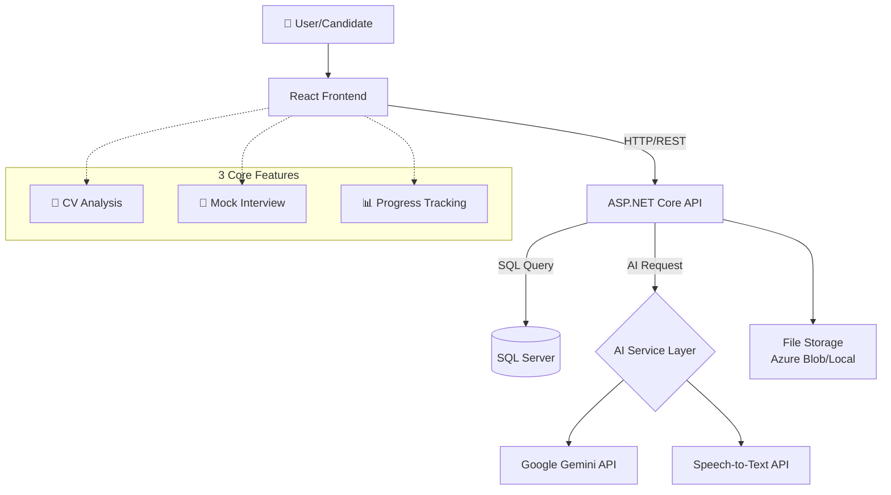
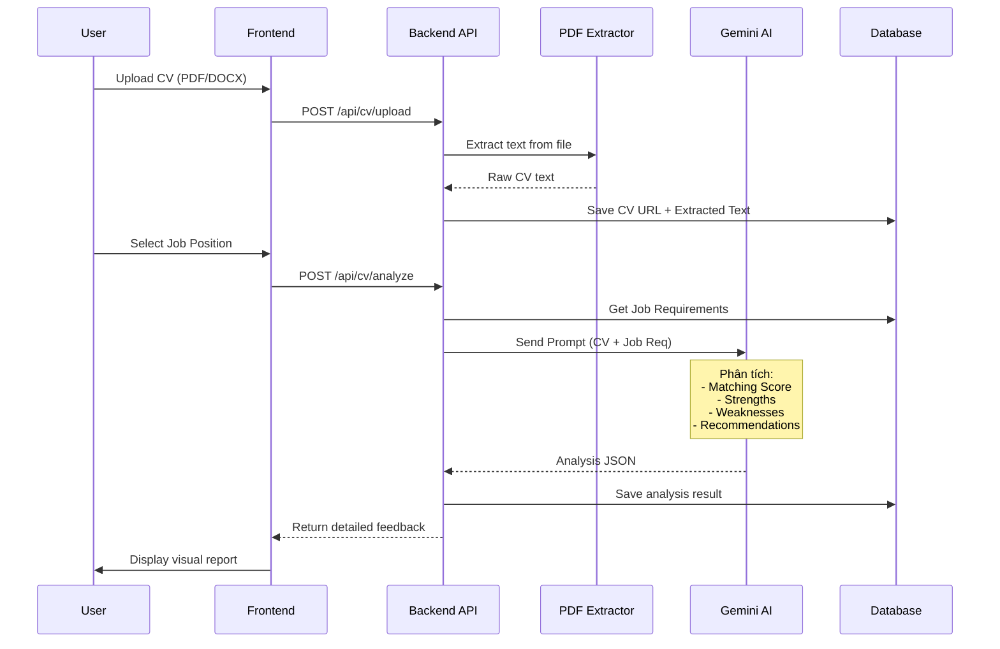
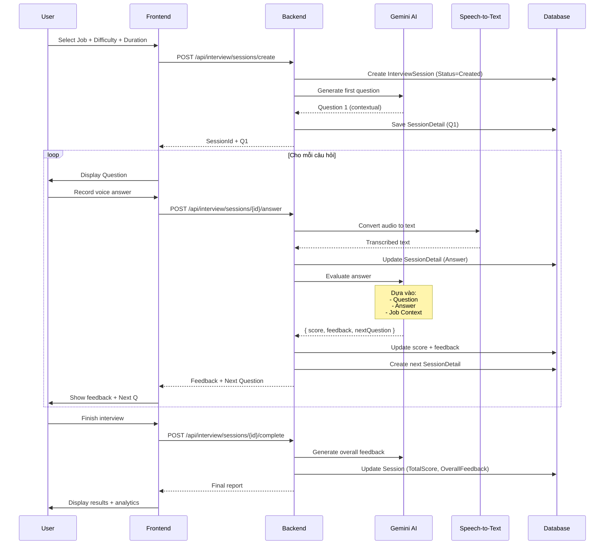
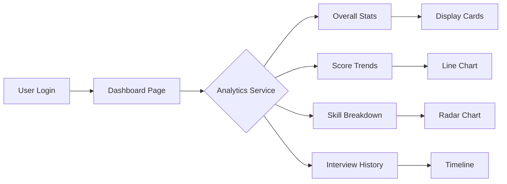

# Kế Hoạch Triển Khai Hệ Thống AI Interview Simulator - MockMate

## Tổng Quan Dự Án

MockMate là một nền tảng **AI-powered Interview Simulator** giúp ứng viên:
- ✅ **Đánh giá CV** bằng AI theo từng vị trí công việc cụ thể
- ✅ **Luyện tập phỏng vấn** với AI thông minh, tương tác real-time
- ✅ **Theo dõi tiến độ** qua dashboard analytics chi tiết

### Công Nghệ Hiện Tại
- **Frontend**: React 19 + Vite + TailwindCSS + React Router
- **Backend**: ASP.NET Core 8.0 + Entity Framework Core + SQL Server
- **Database**: SQL Server (MockMateDB) với 8 bảng chính
- **Authentication**: Email/Password (có sẵn JWT config)

---

## I. KIẾN TRÚC TỔNG THỂ

### 1. Sơ Đồ Luồng Dữ Liệu



### 2. Kiến Trúc Backend (Clean Architecture)

```
📁 InterviewSimulator/
├── 📁 Controllers/          → API Endpoints
│   ├── AuthController.cs
│   ├── CvController.cs      [MỚI]
│   ├── InterviewController.cs [MỚI]
│   └── AnalyticsController.cs [MỚI]
├── 📁 Services/             → Business Logic [MỚI]
│   ├── Interfaces/
│   │   ├── IAiService.cs
│   │   ├── ICvAnalysisService.cs
│   │   ├── IInterviewService.cs
│   │   └── IFileStorageService.cs
│   └── Implementations/
│       ├── GeminiAiService.cs
│       ├── CvAnalysisService.cs
│       ├── InterviewService.cs
│       └── FileStorageService.cs
├── 📁 Models/               → Entities (Có sẵn)
│   └── DTOs/                [MỚI]
│       ├── CvAnalysisDto.cs
│       ├── InterviewDto.cs
│       └── ProgressDto.cs
├── 📁 Helpers/              [MỚI]
│   ├── PdfExtractor.cs      → Convert PDF → Text
│   ├── AudioProcessor.cs    → Xử lý file audio
│   └── PromptBuilder.cs     → Tạo prompt cho AI
└── 📁 Middleware/           [MỚI]
    └── ErrorHandlingMiddleware.cs
```

### 3. Kiến Trúc Frontend

```
📁 src/
├── 📁 pages/
│   ├── HomePage.jsx         ✅ (Đã có)
│   ├── LoginPage.jsx        ✅ (Đã có)
│   ├── DashboardPage.jsx    [MỚI] → Màn chính sau login
│   ├── CvUploadPage.jsx     [MỚI] → Upload & phân tích CV
│   ├── InterviewSetupPage.jsx [MỚI] → Cấu hình phỏng vấn
│   ├── InterviewRoomPage.jsx  [MỚI] → Phòng phỏng vấn real-time
│   └── ProgressPage.jsx     [MỚI] → Dashboard thống kê
├── 📁 components/
│   ├── dashboard/           [MỚI]
│   │   ├── StatsCard.jsx
│   │   ├── SkillRadarChart.jsx
│   │   └── HistoryTimeline.jsx
│   ├── interview/           [MỚI]
│   │   ├── QuestionCard.jsx
│   │   ├── VoiceRecorder.jsx
│   │   ├── FeedbackPanel.jsx
│   │   └── Timer.jsx
│   └── cv/                  [MỚI]
│       ├── CvUploader.jsx
│       ├── AnalysisResult.jsx
│       └── ScoreCard.jsx
├── 📁 services/             [MỚI]
│   ├── api.js               → Axios instance
│   ├── cvService.js
│   ├── interviewService.js
│   └── analyticsService.js
├── 📁 hooks/                [MỚI]
│   ├── useInterview.js
│   ├── useAudioRecorder.js
│   └── useProgress.js
└── 📁 utils/                [MỚI]
    ├── formatters.js
    └── validators.js
```

---

## II. CHI TIẾT 3 TÍNH NĂNG CHÍNH

## 🎯 Feature 1: AI CV Evaluation (Đánh Giá CV)

### Workflow



### Backend Implementation

#### **CvController.cs**
```plaintext
Endpoints cần triển khai:

1. POST /api/cv/upload
   - Input: IFormFile (PDF/DOCX)
   - Process:
     * Upload file lên storage (Azure Blob hoặc wwwroot/uploads)
     * Trích xuất text từ PDF/DOCX
     * Lưu CvUrl và CvExtractedText vào bảng Users
   - Output: { success, cvUrl, extractedText }

2. POST /api/cv/analyze
   - Input: { userId, jobPositionId }
   - Process:
     * Lấy CV text từ Users.CvExtractedText
     * Lấy Job Requirements từ JobPositions
     * Build prompt cho AI Gemini
     * Gọi Gemini API phân tích
     * Parse JSON response
   - Output: CvAnalysisDto {
       matchingScore: 75,
       strengths: ["5 years .NET", "Strong SQL"],
       weaknesses: ["No cloud experience"],
       recommendations: ["Learn Azure", "Study microservices"],
       detailedFeedback: "..."
     }
```

#### **AI Prompt Strategy**

```plaintext
Prompt Template cho Gemini:

---
ROLE: You are an expert technical recruiter analyzing a candidate's CV.

JOB POSITION: {jobTitle}
REQUIREMENTS: {jobRequirements}

CANDIDATE CV:
{cvExtractedText}

EXPERIENCE YEARS: {experienceYears}

TASK: Analyze the CV against the job requirements and provide:

1. MATCHING_SCORE (0-100): How well the CV matches the requirements
2. STRENGTHS (array): Top 5 matching skills/experiences
3. WEAKNESSES (array): Top 3 gaps or areas to improve
4. RECOMMENDATIONS (array): 5 specific actions to improve candidacy
5. DETAILED_FEEDBACK (string): 2-3 paragraphs summary

OUTPUT FORMAT: Valid JSON only
{
  "matchingScore": 85,
  "strengths": ["..."],
  "weaknesses": ["..."],
  "recommendations": ["..."],
  "detailedFeedback": "..."
}
---
```

### Frontend Implementation

#### **CvUploadPage.jsx**
```plaintext
Layout gồm 3 bước:

Step 1: Upload CV
  - Drag & drop zone cho PDF/DOCX
  - Progress bar khi upload
  - Preview extracted text

Step 2: Select Job Position
  - Dropdown chọn Category (IT, Marketing,...)
  - Dropdown chọn Position (.NET Dev, React Dev,...)

Step 3: View Analysis
  - Matching Score (circular progress)
  - Strengths/Weaknesses cards
  - Recommendations timeline
  - Download PDF report button
```

---

## 🎤 Feature 2: Mock Interview (Phỏng Vấn Mô Phỏng)

### Workflow



### Backend Implementation

#### **InterviewController.cs**

```plaintext
1. POST /api/interview/sessions/create
   Input: {
     userId,
     jobPositionId,
     difficultyLevel: 0=Beginner | 1=Intermediate | 2=Advanced,
     durationMode: 0=Short(5Q) | 1=Standard(10Q) | 2=Deep(15Q)
   }
   Process:
     - Create InterviewSession in DB (Status=Created)
     - Generate first question based on job + difficulty
     - Save first SessionDetail
   Output: { sessionId, firstQuestion }

2. POST /api/interview/sessions/{id}/start
   - Update Status → InProgress
   - Set StartedAt timestamp

3. POST /api/interview/sessions/{id}/answer
   Input: {
     sessionDetailId,
     answerAudioFile?,  // Optional voice recording
     answerText?        // Or typed text
   }
   Process:
     - If audio: call Speech-to-Text API
     - Update SessionDetail.AnswerContent
     - Send to AI for evaluation
     - AI returns: score (0-10), feedback, and generates next question
     - Save next SessionDetail
     - Calculate TimeTakenSeconds
   Output: {
     currentScore,
     aiFeedback,
     nextQuestion,
     isLastQuestion
   }

4. POST /api/interview/sessions/{id}/complete
   Process:
     - Calculate TotalScore (average of all SessionDetails)
     - Generate OverallFeedback from AI:
       * Summarize strengths
       * Identify consistent weaknesses
       * Determine CareerFitRating (0-3)
     - Set Status → Completed, EndedAt timestamp
   Output: {
     totalScore,
     careerFitRating,
     overallFeedback,
     sessionDetails[]
   }

5. GET /api/interview/sessions/{id}/results
   - Return full session + all details for review
```

#### **AI Question Generation Strategy**

```plaintext
Prompt cho việc tạo câu hỏi:

---
CONTEXT:
- Job Position: {jobTitle}
- Requirements: {jobRequirements}
- Difficulty: {difficultyLevel}
- Candidate CV Summary: {cvHighlights}
- Interview Progress: Question {currentIndex}/{totalQuestions}
- Previous Answers Summary: {previousAnswersSummary}

TASK: Generate the next interview question.

RULES:
1. Start with basic questions, gradually increase difficulty
2. Adapt based on previous answers (if user struggles, make easier)
3. Mix question types:
   - Technical knowledge (40%)
   - Problem-solving scenarios (30%)
   - Behavioral (20%)
   - Experience-based (10%)
4. Make questions realistic (what real interviewers ask)

OUTPUT FORMAT: Plain text question only
---

Prompt cho việc đánh giá câu trả lời:

---
QUESTION: {questionContent}
ANSWER: {answerContent}
JOB CONTEXT: {jobTitle} - {requirements}

TASK: Evaluate this answer and provide feedback.

CRITERIA:
1. Relevance to question (0-3 points)
2. Technical accuracy (0-3 points)
3. Depth of understanding (0-2 points)
4. Communication clarity (0-2 points)

OUTPUT FORMAT: Valid JSON
{
  "score": 8.5,
  "feedback": "Strong answer demonstrating...",
  "strengths": ["Clear structure", "Good examples"],
  "improvements": ["Could mention more about..."]
}
---
```

### Frontend Implementation

#### **InterviewRoomPage.jsx**

```plaintext
Layout thiết kế:

┌─────────────────────────────────────┐
│  Header: Timer | Question 3/10      │
├─────────────────────────────────────┤
│                                     │
│   📹 Webcam Preview (Optional)      │
│                                     │
├─────────────────────────────────────┤
│  💬 Question Card                   │
│  "Explain the difference between    │
│   IEnumerable and IQueryable"       │
├─────────────────────────────────────┤
│  🎤 Voice Recorder                  │
│  ● Recording... 1:23                │
│  [Stop] [Play Back]                 │
│                                     │
│  OR                                 │
│                                     │
│  ⌨️ Text Input (if user prefers)    │
│  [Text area for typing answer]      │
├─────────────────────────────────────┤
│  [Submit Answer] [Skip]             │
└─────────────────────────────────────┘

Sau khi submit:
  → Show loading animation
  → Display feedback panel:
    - Score badge (8.5/10)
    - AI feedback text
    - Animated confetti for high scores
  → Button: "Next Question"

Components cần xây dựng:
  - VoiceRecorder.jsx (dùng MediaRecorder API)
  - Timer.jsx (countdown per question)
  - FeedbackPanel.jsx (hiển thị kết quả)
  - ProgressBar.jsx (visual progress)
```

---

## 📊 Feature 3: Progress Tracking (Theo Dõi Tiến Độ)

### Workflow



### Backend Implementation

#### **AnalyticsController.cs**

```plaintext
1. GET /api/analytics/overview?userId={id}
   Output: {
     totalInterviews: 15,
     averageScore: 7.8,
     improvementRate: +12%, // So với 5 sessions trước
     topSkillScore: "Problem Solving: 9.2",
     weakestSkill: "System Design: 5.1",
     totalHoursPracticed: 8.5
   }

2. GET /api/analytics/progress?userId={id}&period={30days}
   Output: [
     { date: "2024-01-15", avgScore: 6.5 },
     { date: "2024-01-20", avgScore: 7.2 },
     { date: "2024-01-25", avgScore: 8.1 }
   ]

3. GET /api/analytics/skills?userId={id}
   Output: {
     technical: 8.2,
     problemSolving: 7.5,
     communication: 6.8,
     behavioral: 9.0,
     domainKnowledge: 7.1
   }

4. GET /api/analytics/history?userId={id}&limit=10
   Output: [
     {
       sessionId: 123,
       jobTitle: ".NET Backend Developer",
       date: "2024-01-20",
       score: 8.5,
       careerFit: "High",
       questionsCount: 10
     },
     ...
   ]

5. GET /api/analytics/recommendations?userId={id}
   - AI tạo career tasks dựa vào weaknesses
   - Output: CareerTask[] (Title, Description, ResourceLink)
```

### Frontend Implementation

#### **ProgressPage.jsx**

```plaintext
Dashboard Layout:

┌─────────────────────────────────────────┐
│  📊 My Interview Progress               │
├──────────────┬──────────────────────────┤
│ Stats Cards  │  Total: 15 interviews    │
│              │  Avg Score: 7.8/10       │
│              │  Improvement: ↑ 12%      │
├──────────────┴──────────────────────────┤
│  📈 Score Trend (Line Chart)            │
│  [Recharts/Chart.js visualization]      │
├─────────────────────────────────────────┤
│  🕸️ Skills Radar                        │
│  [Radar chart: 5 skill categories]      │
├──────────────┬──────────────────────────┤
│ Interview    │  📅 Timeline of sessions │
│ History      │  [Vertical timeline]     │
├──────────────┴──────────────────────────┤
│  💡 AI Recommendations                  │
│  → Learn SOLID principles               │
│  → Practice LeetCode medium problems    │
│  → Read "Clean Architecture" book       │
└─────────────────────────────────────────┘

Libraries:
  - Recharts hoặc Chart.js cho biểu đồ
  - Framer Motion cho animations
  - Lucide React cho icons
```

---

## III. TÍCH HỢP AI (GEMINI API)

### 1. Setup & Configuration

#### **appsettings.json**
```json
{
  "Gemini": {
    "ApiKey": "YOUR_GEMINI_API_KEY",
    "Model": "gemini-2.0-flash-exp",
    "BaseUrl": "https://generativelanguage.googleapis.com/v1beta",
    "Temperature": 0.7,
    "MaxTokens": 2048
  },
  "SpeechToText": {
    "Provider": "Google", // hoặc "Azure"
    "ApiKey": "YOUR_STT_API_KEY"
  }
}
```

#### **GeminiAiService.cs (Service Implementation)**

```plaintext
Interface IAiService:
  - Task<string> GenerateQuestionAsync(context)
  - Task<EvaluationResult> EvaluateAnswerAsync(question, answer, context)
  - Task<CvAnalysisResult> AnalyzeCvAsync(cvText, jobReq)
  - Task<string> GenerateOverallFeedbackAsync(sessionDetails)

Implementation:
  - Sử dụng HttpClient để call Gemini REST API
  - Endpoint: POST https://generativelanguage.googleapis.com/v1beta/models/gemini-2.0-flash-exp:generateContent
  - Headers: { "x-goog-api-key": apiKey }
  - Body: {
      "contents": [{
        "parts": [{ "text": promptText }]
      }],
      "generationConfig": {
        "temperature": 0.7,
        "maxOutputTokens": 2048
      }
    }
  - Parse response JSON và extract text content
  - Implement retry logic (3 lần) nếu API fail
  - Log all requests/responses cho debugging
```

### 2. Alternative: OpenAI Integration

```plaintext
Nếu muốn dùng OpenAI thay vì Gemini:

1. Change model to: "gpt-4-turbo" hoặc "gpt-3.5-turbo"
2. API endpoint: https://api.openai.com/v1/chat/completions
3. Headers: { "Authorization": "Bearer YOUR_OPENAI_KEY" }
4. Body format: {
     "model": "gpt-4-turbo",
     "messages": [
       { "role": "system", "content": systemPrompt },
       { "role": "user", "content": userPrompt }
     ],
     "temperature": 0.7
   }

Lợi ích OpenAI:
  ✅ Response quality cao hơn
  ✅ Function calling tốt hơn
  ❌ Chi phí cao hơn Gemini
```

---

## IV. DATABASE MODIFICATIONS

### Bảng Cần Thêm (Tùy Chọn)

```sql
-- 1. Lưu kết quả phân tích CV
CREATE TABLE CvAnalysisResults (
    Id INT IDENTITY(1,1) PRIMARY KEY,
    UserId INT NOT NULL,
    JobPositionId INT NOT NULL,
    MatchingScore FLOAT,
    AnalysisJson NVARCHAR(MAX),  -- Lưu full JSON từ AI
    CreatedAt DATETIME2 DEFAULT GETDATE(),
    
    CONSTRAINT FK_CvAnalysis_Users FOREIGN KEY (UserId) REFERENCES Users(Id),
    CONSTRAINT FK_CvAnalysis_Jobs FOREIGN KEY (JobPositionId) REFERENCES JobPositions(Id)
);

-- 2. Lưu metadata file uploads
CREATE TABLE UploadedFiles (
    Id INT IDENTITY(1,1) PRIMARY KEY,
    UserId INT NOT NULL,
    FileType NVARCHAR(20),  -- 'CV', 'Audio'
    OriginalFileName NVARCHAR(255),
    StoragePath NVARCHAR(500),
    FileSize BIGINT,
    UploadedAt DATETIME2 DEFAULT GETDATE(),
    
    CONSTRAINT FK_Files_Users FOREIGN KEY (UserId) REFERENCES Users(Id)
);

-- 3. Notifications/Tasks cho user
-- (Có thể dùng bảng CareerTasks sẵn có)

-- Index cho performance
CREATE INDEX IX_CvAnalysis_UserId ON CvAnalysisResults(UserId);
CREATE INDEX IX_Files_UserId ON UploadedFiles(UserId);
```

### Sửa Đổi Bảng Hiện Tại

```sql
-- Thêm cột vào InterviewSessions nếu cần
ALTER TABLE InterviewSessions ADD 
    AiModelUsed NVARCHAR(50),  -- 'gemini-pro', 'gpt-4'
    TotalTokensUsed INT;       -- Tracking cost

-- Thêm metadata vào SessionDetails
ALTER TABLE SessionDetails ADD
    AnswerTranscriptConfidence FLOAT,  -- STT confidence score
    EvaluationMetadata NVARCHAR(MAX);  -- JSON thêm data từ AI
```

---

## V. WORKFLOW TRIỂN KHAI

### Phase 1: Foundation Setup (Tuần 1-2)

#### Backend Infrastructure
```
✅ Bước 1: Setup Project Structure
  - Tạo folders: Services/, DTOs/, Helpers/
  - Install NuGet packages:
    * iTextSharp (PDF extraction)
    * Azure.Storage.Blobs (file storage)
    * Newtonsoft.Json

✅ Bước 2: Implement Core Services
  - GeminiAiService.cs
  - FileStorageService.cs
  - Add dependency injection trong Program.cs

✅ Bước 3: Database Migration
  - Chạy SQL scripts tạo bảng mới
  - Update MockMateDbContext.cs
  - Test connection

✅ Bước 4: Basic Auth Enhancement
  - Thêm JWT authentication middleware
  - Protect API endpoints với [Authorize]
```

#### Frontend Infrastructure
```
✅ Bước 1: Setup Routing
  - Cài thêm packages: axios, recharts, framer-motion
  - Update App.jsx với protected routes
  - Tạo AuthContext để manage user state

✅ Bước 2: Create Base Layout
  - DashboardLayout.jsx (sidebar + header)
  - Protected Route wrapper

✅ Bước 3: API Service Setup
  - api.js với axios interceptors
  - Handle token refresh
  - Error handling
```

---

### Phase 2: Feature Implementation (Tuần 3-5)

#### Tuần 3: CV Analysis
```
Backend:
  1. CvController + CvAnalysisService
  2. PDF text extraction
  3. Gemini integration cho analysis
  4. Test với Postman

Frontend:
  1. CvUploadPage.jsx
  2. File uploader component
  3. Analysis result visualization
  4. Download PDF report
```

#### Tuần 4-5: Mock Interview
```
Backend:
  1. InterviewController + InterviewService
  2. Question generation logic
  3. Answer evaluation
  4. Speech-to-Text integration (nếu dùng)

Frontend:
  1. InterviewSetupPage (chọn job, difficulty)
  2. InterviewRoomPage (main UI)
  3. VoiceRecorder component
  4. Real-time feedback display
  5. Results summary page
```

#### Tuần 6: Progress Tracking
```
Backend:
  1. AnalyticsController
  2. Complex queries cho statistics
  3. AI recommendations engine

Frontend:
  1. ProgressPage/Dashboard
  2. Charts integration (Recharts)
  3. Timeline component
  4. Export reports
```

---

### Phase 3: Polish & Optimization (Tuần 7-8)

```
✅ Performance Optimization
  - Cache AI responses (Redis nếu có)
  - Lazy loading components
  - Image optimization

✅ UX Enhancements
  - Loading states cho mọi async actions
  - Error boundaries
  - Toast notifications
  - Smooth transitions

✅ Testing
  - Unit tests cho services
  - Integration tests cho API
  - E2E testing với Playwright (optional)

✅ Documentation
  - API documentation (Swagger)
  - User guide
  - Deployment guide
```

---

## VI. CÔNG NGHỆ & THƯ VIỆN CẦN BỔ SUNG

### Backend NuGet Packages

```xml
<!-- File storage -->
<PackageReference Include="Azure.Storage.Blobs" Version="12.19.0" />

<!-- PDF processing -->
<PackageReference Include="itext7" Version="8.0.2" />
<!-- Hoặc -->
<PackageReference Include="PdfSharp" Version="6.0.0" />

<!-- Authentication -->
<PackageReference Include="Microsoft.AspNetCore.Authentication.JwtBearer" Version="8.0.0" />
<PackageReference Include="System.IdentityModel.Tokens.Jwt" Version="7.0.0" />

<!-- HTTP Client -->
<PackageReference Include="Microsoft.Extensions.Http" Version="8.0.0" />

<!-- Optional: Redis cache -->
<PackageReference Include="StackExchange.Redis" Version="2.7.10" />
```

### Frontend npm Packages

```json
{
  "dependencies": {
    "axios": "^1.6.5",
    "recharts": "^2.10.0",
    "framer-motion": "^11.0.0",
    "lucide-react": "^0.300.0",
    "react-dropzone": "^14.2.3",
    "react-hot-toast": "^2.4.1",
    "zustand": "^4.5.0"
  }
}
```

---

## VII. API ENDPOINTS SUMMARY

### Authentication
```
POST /api/auth/register
POST /api/auth/login
POST /api/auth/forgot-password
```

### CV Analysis
```
POST /api/cv/upload             → Upload CV file
POST /api/cv/analyze            → Analyze CV against job
GET  /api/cv/history/{userId}   → Past CV analyses
```

### Interview
```
POST /api/interview/sessions/create       → Create session
POST /api/interview/sessions/{id}/start   → Start interview
POST /api/interview/sessions/{id}/answer  → Submit answer
POST /api/interview/sessions/{id}/complete → Finish
GET  /api/interview/sessions/{id}/results → Get full report
GET  /api/interview/sessions/user/{userId} → User's sessions
```

### Analytics
```
GET /api/analytics/overview/{userId}
GET /api/analytics/progress/{userId}
GET /api/analytics/skills/{userId}
GET /api/analytics/history/{userId}
GET /api/analytics/recommendations/{userId}
```

### Job Positions (Master Data)
```
GET /api/jobs/categories        → List categories
GET /api/jobs/positions         → List positions
GET /api/jobs/positions/{id}    → Position details
```

---

## VIII. SECURITY & BEST PRACTICES

### Security Checklist
```
✅ Authentication & Authorization
  - JWT tokens với expiration
  - Refresh token mechanism
  - Role-based access (Admin vs Candidate)

✅ File Upload Security
  - Validate file types (.pdf, .docx only)
  - Maximum file size limit (5MB)
  - Virus scanning (nếu production)
  - Sanitize file names

✅ API Security
  - Rate limiting (prevent spam)
  - Input validation & sanitization
  - SQL injection prevention (dùng EF parameterized queries)
  - CORS configuration

✅ Data Privacy
  - Encrypt sensitive data (PasswordHash đã có)
  - Soft delete cho user data
  - GDPR compliance (delete all user data on request)

✅ AI Prompt Injection Prevention
  - Sanitize user inputs trước khi gửi AI
  - Giới hạn độ dài response
  - Monitor unusual AI behaviors
```

### Performance Best Practices
```
✅ Backend
  - Async/await cho tất cả I/O operations
  - Database indexing (đã có trong schema)
  - Pagination cho large datasets
  - Response caching cho static data

✅ Frontend
  - Code splitting (React.lazy)
  - Memoization (useMemo, React.memo)
  - Debounce user inputs
  - Optimistic UI updates
```

---

## IX. COST ESTIMATION (AI API)

### Gemini API (Google)
```
Model: gemini-2.0-flash-exp
Pricing: ~$0.075 / 1M tokens (input)
         ~$0.30 / 1M tokens (output)

Ước tính cho 1 interview session (10 câu hỏi):
  - Input tokens: ~5,000 (CV + context + questions)
  - Output tokens: ~3,000 (answers + feedback)
  - Cost per session: ~$0.001 (rất rẻ)

→ 1000 interviews = $1 USD
```

### OpenAI (Alternative)
```
Model: gpt-4-turbo
Pricing: ~$10 / 1M tokens (input)
         ~$30 / 1M tokens (output)

→ Đắt hơn ~100x so với Gemini
→ Chỉ nên dùng cho premium features
```

### Speech-to-Text (Nếu dùng)
```
Google Speech-to-Text:
  - $0.006 / 15 seconds
  - 1 phút answer ≈ $0.024
  - 10 câu hỏi ≈ $0.24 per session

→ Đây là phần đắt nhất, có thể:
  1. Cho user option type thay vì nói
  2. Giới hạn recording time
  3. Dùng browser Web Speech API (free nhưng less accurate)
```

---

## X. DEPLOYMENT STRATEGY

### Development Environment
```
1. Local setup:
   - SQL Server Developer Edition
   - .NET 8 SDK
   - Node.js 20+

2. Environment variables (.env):
   VITE_API_URL=http://localhost:5000
   VITE_GEMINI_API_KEY=xxx

3. Run commands:
   Backend: dotnet run --project InterviewSimulator
   Frontend: npm run dev
```

### Production Deployment Options

#### Option 1: Azure (Recommended)
```
Backend:
  → Azure App Service (ASP.NET Core)
  → Azure SQL Database
  → Azure Blob Storage (files)
  → Azure Application Insights (monitoring)

Frontend:
  → Vercel / Netlify (static hosting)
  → Environment variables configured

Estimated cost: $30-50/month
```

#### Option 2: Self-Hosted (Budget)
```
Backend + DB:
  → VPS (DigitalOcean/Vultr)
  → Nginx reverse proxy
  → PostgreSQL (thay SQL Server)

Frontend:
  → Same VPS hoặc Vercel free tier

Estimated cost: $10-20/month
```

---

## XI. TESTING STRATEGY

### Backend Testing
```csharp
// Unit Tests (xUnit)
[Fact]
public async Task AnalyzeCv_ShouldReturnScore_WhenValidInput()
{
    // Arrange
    var service = new CvAnalysisService(mockAI, mockDb);
    var cvText = "5 years .NET experience...";
    var jobId = 1;

    // Act
    var result = await service.AnalyzeCvAsync(cvText, jobId);

    // Assert
    Assert.InRange(result.MatchingScore, 0, 100);
    Assert.NotEmpty(result.Strengths);
}

// Integration Tests
[Fact]
public async Task Interview_EndToEnd_WorksCorrectly()
{
    // Create session → Answer questions → Complete
    // Verify database state
}
```

### Frontend Testing
```javascript
// Jest + React Testing Library
test('CV upload shows success message', async () => {
  render(<CvUploadPage />);
  
  const file = new File(['dummy'], 'cv.pdf', { type: 'application/pdf' });
  const input = screen.getByLabelText(/upload/i);
  
  await userEvent.upload(input, file);
  
  expect(await screen.findByText(/success/i)).toBeInTheDocument();
});
```

---

## XII. FUTURE ENHANCEMENTS (Nâng Cao)

### V2.0 Features
```
🎯 Video Interview Simulation
  - Webcam recording + facial expression analysis
  - Eye contact tracking
  - Confidence score based on body language

🎯 Peer Comparison
  - Anonymous leaderboard
  - Compare với candidates cùng level
  - Competitive practice mode

🎯 Industry-Specific Templates
  - Healthcare, Finance, Education,...
  - Specialized question banks

🎯 AI Mock Interviewer Personalities
  - Friendly coach
  - Strict interviewer
  - Conversational style
  - User can choose

🎯 Team/Company Features
  - Company dashboard (HR view candidates)
  - Bulk candidate evaluation
  - Custom job positions

🎯 Mobile App
  - React Native version
  - Practice on-the-go
```

---

## XIII. TECHNICAL CHALLENGES & SOLUTIONS

### Challenge 1: AI Response Consistency
**Problem**: AI có thể trả về format không đúng
**Solution**:
  - Enforce JSON mode trong prompt
  - Validate response với JSON schema
  - Retry với adjusted prompt nếu fail
  - Fallback to default values

### Challenge 2: Real-time Experience
**Problem**: AI API có thể chậm (2-5s)
**Solution**:
  - Show loading animations
  - Stream responses nếu API hỗ trợ
  - Pre-generate một số câu hỏi
  - Cache common scenarios

### Challenge 3: Speech-to-Text Accuracy
**Problem**: Accent, background noise
**Solution**:
  - Cho phép edit transcript trước submit
  - Hoặc cho option type answer
  - Multi-language support
  - Noise cancellation filter

### Challenge 4: Cost Control
**Problem**: AI API cost tăng nhanh
**Solution**:
  - Rate limiting per user
  - Free tier: 5 sessions/month
  - Premium: unlimited
  - Cache repeated questions

---

## XIV. TÀI LIỆU THAM KHẢO

### API Documentation
```
1. Google Gemini API:
   https://ai.google.dev/docs

2. OpenAI API:
   https://platform.openai.com/docs

3. Google Speech-to-Text:
   https://cloud.google.com/speech-to-text/docs

4. Azure Blob Storage:
   https://learn.microsoft.com/en-us/azure/storage/blobs/
```

### Libraries & Frameworks
```
1. iText7 (PDF):
   https://github.com/itext/itext7-dotnet

2. Recharts:
   https://recharts.org/

3. React Dropzone:
   https://react-dropzone.js.org/

4. Framer Motion:
   https://www.framer.com/motion/
```

---

## XV. KẾT LUẬN & NEXT STEPS

### Tóm Tắt Kế Hoạch

MockMate sẽ là một **All-in-One Interview Preparation Platform** với:

✅ **AI CV Analyzer** - Tự động chấm điểm CV theo job description  
✅ **Mock Interview Simulator** - Phỏng vấn thông minh với adaptive questions  
✅ **Progress Dashboard** - Theo dõi tiến bộ qua biểu đồ trực quan  

### Technology Stack
```
Frontend : React 19 + TailwindCSS + Recharts
Backend  : ASP.NET Core 8 + Entity Framework
Database : SQL Server
AI Engine: Google Gemini API (hoặc OpenAI)
Storage  : Azure Blob / Local File System
```

### Timeline Dự Kiến
```
Week 1-2  : Setup infrastructure + Core services
Week 3    : CV Analysis feature
Week 4-5  : Mock Interview feature
Week 6    : Progress Tracking feature
Week 7-8  : Testing + Polish + Deployment
```

### Quyết Định Cần USER Review

> [!IMPORTANT]
> **Các Quyết Định Quan Trọng Cần Xác Nhận:**
>
> 1. **AI Provider**: Dùng Gemini (rẻ) hay OpenAI (tốt hơn)?
> 2. **Speech-to-Text**: Có implement voice recording không? Hay chỉ text?
> 3. **Cloud Storage**: Azure Blob hay lưu local (wwwroot/uploads)?
> 4. **Authentication**: JWT đơn giản hay OAuth (Google/Facebook login)?
> 5. **Deployment**: Azure ($50/mo) hay VPS tự host ($10/mo)?
> 6. **Free vs Premium**: Có giới hạn số lần dùng cho free users không?

> [!TIP]
> **Khuyến Nghị của Tôi:**
>
> - AI: **Gemini** (cost-effective, đủ tốt cho MVP)
> - Speech: **Bắt đầu với text-only**, thêm voice sau
> - Storage: **Local file system** cho development, Azure cho production
> - Auth: **JWT đơn giản** trước, OAuth là nice-to-have
> - Deploy: **Azure App Service** (dễ scale, professional)
> - Monetization: **Free: 5 sessions/month, Premium: unlimited**

---

## 📞 CONTACT & SUPPORT

Khi triển khai, bạn có thể hỏi tôi chi tiết về:
- Code implementation cho từng phần
- Debugging issues
- Architecture decisions
- Performance optimization
- Deployment steps

**Sẵn sàng bắt đầu coding khi bạn đã review xong plan này! 🚀**
